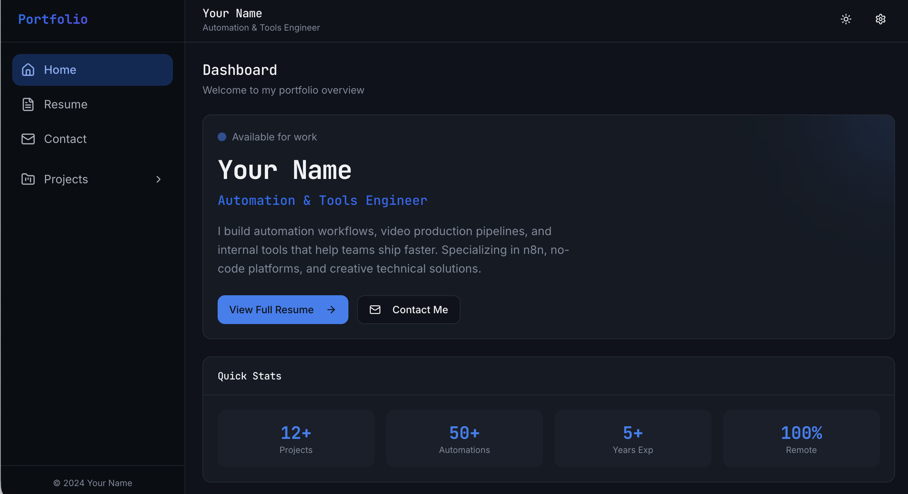
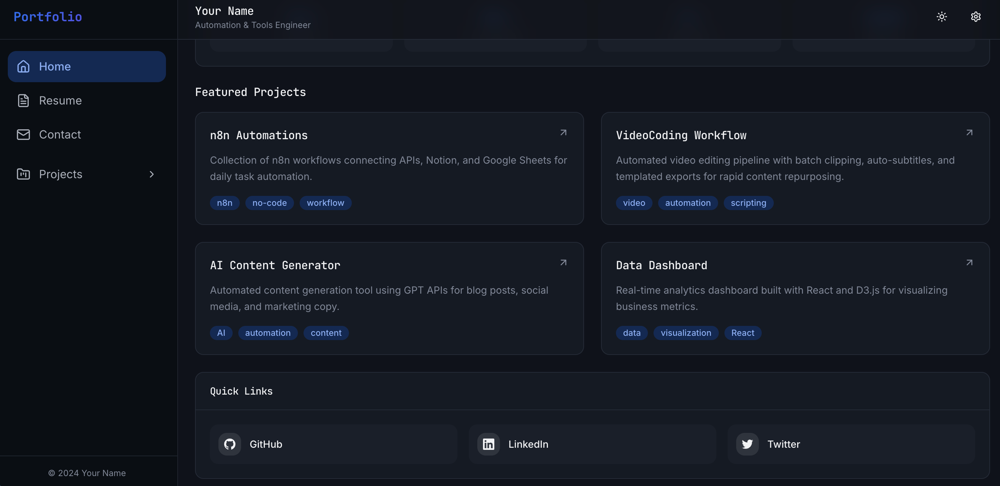

# 🚀 Your Personal Portfolio Dashboard

A modern, data-driven personal portfolio dashboard template built with React and Tailwind CSS.

## ℹ️ Project Info

**Demo URL**: [https://awesomeui-portfolio.lovable.app](https://awesomeui-portfolio.lovable.app)

## 📸 Screenshots




## 💻 Getting Started

To use this template, ensure you have Node.js & npm installed. We recommend using [nvm](https://github.com/nvm-sh/nvm#installing-and-updating).

Follow these steps to get running:

```sh
# Step 1: Clone the repository
git clone <YOUR_GIT_URL>

# Step 2: Navigate to the project directory
cd my-personal-portfolio

# Step 3: Install dependencies
npm install

# Step 4: Start the development server
npm run dev
```

## 🛠️ Tech Stack

This project is built using modern web technologies:

- [Vite](https://vitejs.dev/) - Fast frontend build tool
- [TypeScript](https://www.typescriptlang.org/) - Typed JavaScript
- [React](https://react.dev/) - UI Library
- [shadcn-ui](https://ui.shadcn.com/) - Reusable components built with Radix UI and Tailwind
- [Tailwind CSS](https://tailwindcss.com/) - Utility-first CSS framework
- [Lucide React](https://lucide.dev/) - Beautiful & consistent icons

## 📂 Project Structure

- `src/content`: JSON configuration files. **EDIT THESE files to customize your portfolio.**
- `src/lib`: Utility functions and type definitions (`content.ts`).
- `src/components`: Reusable UI components.
- `src/pages`: Main page components (`ProjectDetail.tsx`, `Resume.tsx`, etc.).

## ⚙️ How to Customize

The website content is fully data-driven via JSON configuration files in `src/content`. To customize your portfolio, edit the following files:

- **`src/content/about.json`**: Update your profile introduction, hero section, key statistics, and **website metadata (title/description)**.
- **`src/content/contact.json`**: Update your contact details (email, phone, location) and social media links.
- **`src/content/projects.json`**: Add your portfolio projects, including descriptions, workflows, and stats.
- **`src/content/resume.json`**: Fill in your professional experience, education history, and skills.
- **`src/content/photo/`**: Directory for storing image assets (e.g., university logos) referenced in `resume.json`.
- **`src/content/resume/`**: Directory for storing your PDF resumes (e.g., `resume(en).pdf`, `resume(ch).pdf`).

## ✨ Key Features
- **Data-Driven Architecture**: Complete separation of content (JSON) and code (React).
- **Rich Project Views**: Detailed project pages with "Workflow" cards and impact statistics.
- **Dynamic Routing**: Automatic slug-based routing for all project pages.

## 🤖 AI Development Tools

This project utilizes AI for rapid iteration:
- **Lovable**: For initial UI generation.
- **Shitch**: For futher UI design.
- **Antigravity**: For advanced code development.