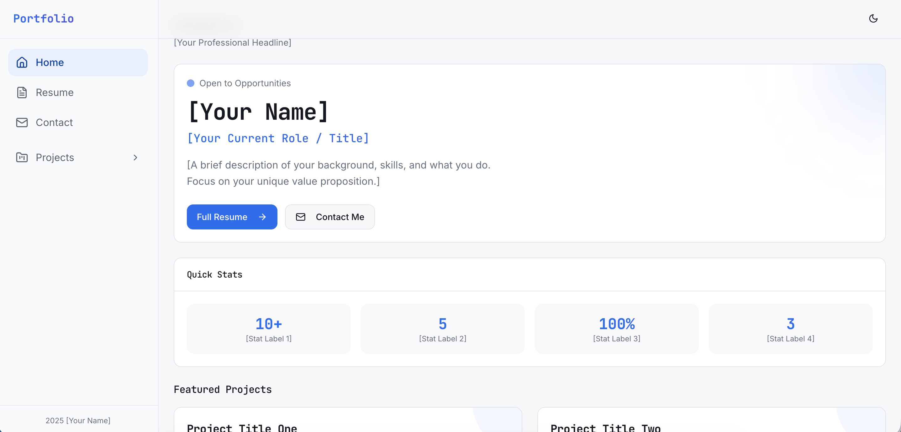
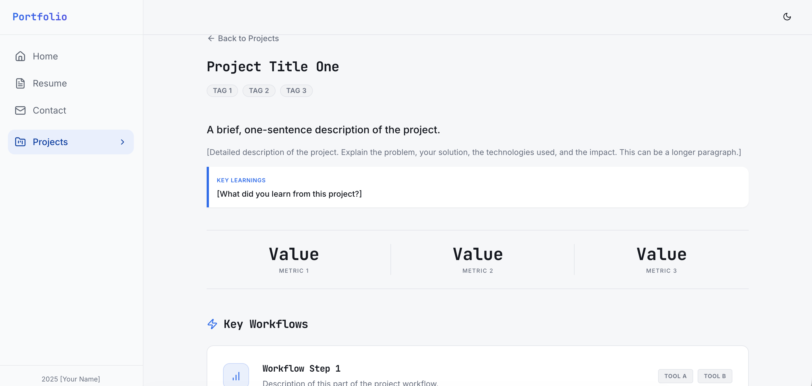
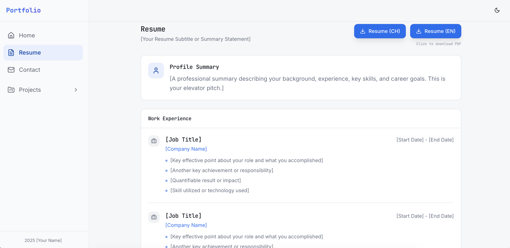

# 🚀 Your Personal Portfolio Dashboard

A modern, data-driven personal portfolio dashboard template built with React and Tailwind CSS.

## 📸 Screenshots




## 💻 Getting Started

To use this template, ensure you have Node.js & npm installed. We recommend using [nvm](https://github.com/nvm-sh/nvm#installing-and-updating).

Follow these steps to get running:

```sh
# Step 1: Clone the repository
git clone <YOUR_GIT_URL>

# Step 2: Navigate to the project directory
cd my-personal-portfolio

# Step 3: Install dependencies
npm install

# Step 4: Start the development server
npm run dev
```

## 🛠️ Tech Stack

This project is built using modern web technologies:

- [Vite](https://vitejs.dev/) - Fast frontend build tool
- [TypeScript](https://www.typescriptlang.org/) - Typed JavaScript
- [React](https://react.dev/) - UI Library
- [shadcn-ui](https://ui.shadcn.com/) - Reusable components built with Radix UI and Tailwind
- [Tailwind CSS](https://tailwindcss.com/) - Utility-first CSS framework
- [Lucide React](https://lucide.dev/) - Beautiful & consistent icons

## 📂 Project Structure

| Folder | Description |
| :--- | :--- |
| `src/content` | **JSON configuration files.** This is where you customize your resume data. |
| `public` | Static assets that are copied directly to the build folder (e.g., `favicon.ico`, `robots.txt`). |
| `dist` | **Distribution folder.** This is generated when you run `npm run build`. It contains the production-ready minified code. |
| `src/lib` | Utility functions and content loaders. |
| `src/components` | UI components built with shadcn/ui. |

## ⚙️ How to Customize

This template is fully data-driven. You don't need to touch much React code to get started. Just edit the JSON files in `src/content`:

1.  **`about.json`**: Hero section text, profile summary, and SEO metadata (page title/description).
2.  **`contact.json`**: Your email, phone, social links (LinkedIn, GitHub, etc.).
3.  **`projects.json`**: Your portfolio projects. Each project can have stats, tags, and detailed "workload" steps.
4.  **`resume.json`**: Your work experience, education, and skills.
5.  **`photo/` & `resume/`**: Drop your profile pictures and PDF resumes here and reference them in the JSON files.

## 🚀 Deployment (GitHub Pages)

This project includes a GitHub Action to automatically deploy your site.

1.  **Fork** this repository.
2.  Go to **Settings > Pages**.
3.  Under **Build and deployment > Source**, select **GitHub Actions**.
4.  When you push to the `main` branch, it will automatically build and deploy.

> [!TIP]
> **Fixing the "White Screen" issue**: The `base` path is automatically calculated in the GitHub Action using the `VITE_BASE_PATH` environment variable. This ensures that assets are correctly loaded even if your repository is named something else.

## 🤖 AI Development Tools

This project utilizes AI for rapid iteration:
- **Lovable**: For initial UI generation.
- **Shitch**: For futher UI design.
- **Antigravity**: For advanced code development.